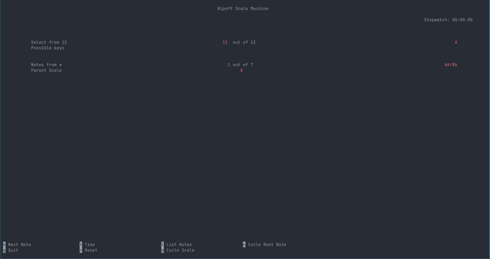

# Ripoff Scale Machine

A simple terminal based musical note selector based off the https://www.therandomscalemachine.com/.

## Features
    - Randomized Note Sequencer
    - Stopwatch (Start/Stop/Reset)
    - NcursesUI
    - Keybinds:
        - k: Next note
        - t: Start/Stop Stopwatch
        - r: Reset Stopwatch
        - l: Toggle List of Notes
        - q: Quit

### Compile
clang -o main main.c -lncurses

#### Main Interface

